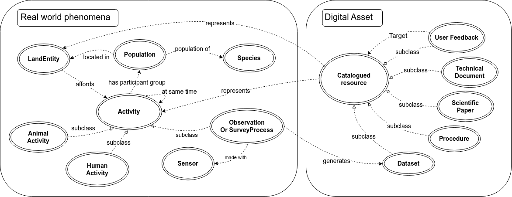

**Outdoorpressure Knowledge Graph** encodes into a graph model different information needed to discover and reuse data to study the impact of recreational activities in the french Alps. It reuses classes and properties from [Geodata KG](https://github.com/umrlastig/geodata) which is a more generic KG. Information represented in Outdoorpressure KG spans from digital assets like data sources or processes (see concepts on the right of the figure below) to real world phenomena they represent (see concepts on the left part of the figure).  

*figure : Overview of Outdoorpressure conceptual model*

Nodes and edges are gradually created to support specific tasks within [INTFOROUT project](https://www.umr-lastig.fr/intforout/). These tasks are then showcased through predefined queries in [Sham-Wah application](https://github.com/intForOut/sham-wah). You are welcome to contribute to outdoorpressure or to reuse it and its companion software Sham-Wah.  

Related ressources : 
- [Sham-Wah application](https://github.com/intForOut/sham-wah)  
- [Documentation](https://intforout.github.io/outdoorPressure/index.html) 
     
**Contribute** through github issues in this project : 
- create a UserFeedbac to share your own expertise, experience, or observations about data, software, or papers you read. Follow the [steps](./docs/new_userfeedback.md)
- create a Dataset to describe data that is relevant to the scope. A dataset is "a coherent collection of information or resources (data files, explanatory files, APIs, links, etc.) and metadata (description, publication date, keywords, geographical/temporal coverage, etc.)." Follow the [steps](./docs/new_dataset.md)
- create a Blank issue for everything else of if you are not sure about the categories of instance you wish to insert 
​

*figure : Opening the Github Issue tab*

This work is supported by the ANR research project IntForOut: Multisource spatial data INTegration FOR the Monitoring of Ecosystems under the pressure of OUTdoor recreation (ANR-23-CE55-0003).
