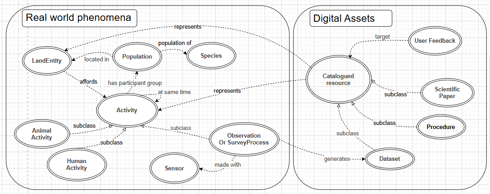

# A Knowledge Graph to support the study of the impact of human recreational activities in the French Alps  

This is a proof of concept of a KG to improve the way we can study the pressure of human outdoor leisure on moutain ecosystems. A particular task is the discovery and proper reuse of data, ranging from GPS collar to camera trap and land cover data. The KG aims at embedding concepts relevant to express users interests in real world phenomena, like "human activities". It also catalogues different assets relevant to investigate these questions with data, like datasets, reproducible processes, scientific papers, or the experience and feedback from other users. 

## How to explore the Knowledge Graph

The KG is in the rdf file outdoorPressure.rdf in this git. A companion to the OutdoorPressure KG is being designed here  https://github.com/IntForOut/sham-wah/blob/main/README.md to ease the way people who are not Knowledge Graph experts can query and explore visually the KG. Alternatively, you may also look at the documentation   [OutdoorPressure ontology](https://intforout.github.io/outdoorPressure/index.html) or use Protégé software.

## How to contribute

The philosophy of the KG is to be an open and collaborative platform. 

### Adding or revising concepts and properties in the KG 
Currently, Intforout participants can contribute to the edition/revision of concepts (classes, object properties, data properties) during webinars organized by the KG moderators.  

### Adding or revising instances of user feedbacks in the KG
You are welcome to propose new instances of the concept of user feedback to share your expertise :
- firstly create the identifier for your feedback, using the path of the KG and adding a specific name for your feedback, as in the example below "https://intforout.github.io/outdoorPressure#QualityOfOVRecreationalUserMapService"
- then check if you have an identifier for the author of the feedback, in the example "http://purl.org/www.umr-lastig.fr/geodata#mdvandamme", 
- then get the identifiers of targeted ressources that your feedback relates to (like a specific data, a specific paper, or even a specific feedback you want to comment on), in the example below it is https://intforout.github.io/outdoorPressure#OVRecreationalUserMapService, there may be more than one
- then write down a file that should look like : 
  
<owl:NamedIndividual rdf:about="FeedbackIdentifier">
        <rdf:type rdf:resource="http://purl.org/www.umr-lastig.fr/geodata#UserFeedback"/>
        <geodata:target rdf:resource="FeedbackIdentifier"/>
        <terms:creator rdf:resource="TargetedRessourcesIdentifier"/>
        <rdfs:comment xml:lang="en"> Your free text comment here</rdfs:comment>
</owl:NamedIndividual> 

For example :   
<owl:NamedIndividual rdf:about="https://intforout.github.io/outdoorPressure#QualityOfOVRecreationalUserMapService">
        <rdf:type rdf:resource="http://purl.org/www.umr-lastig.fr/geodata#UserFeedback"/>
        <geodata:target rdf:resource="https://intforout.github.io/outdoorPressure#OVRecreationalUserMapService"/>
        <terms:creator rdf:resource="http://purl.org/www.umr-lastig.fr/geodata#mdvandamme"/>
        <rdfs:comment xml:lang="en">Artifacts exist in dense urban areas above a certain zoom level. This is because the accuracy of GPS tracks is lower in these areas, making the spatial information displayed less relevant.</rdfs:comment>
</owl:NamedIndividual> 

Puis prévenez un modérateur pour intégration au graph global​
​
## Acknowledgements
This work was supported by the ANR research project **[IntForOut](https://www.umr-lastig.fr/intforout/)**: Multisource spatial data INTegration FOR the Monitoring of Ecosystems under the pressure of OUTdoor recreation (ANR-23-CE55-0003).

