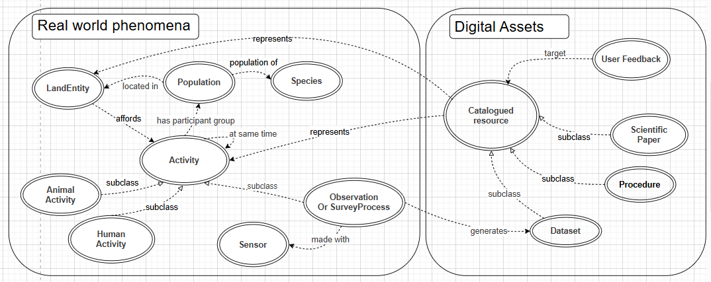

# A Knowledge Graph to support the study of the impact of human recreational activities in the French Alps

This is a proof of concept of a Knowledge Graph (KG) to improve the way we can study the pressure of human outdoor leisure on moutain ecosystems. A particular task is the discovery and proper reuse of data, ranging from GPS collar to camera trap and land cover data. The KG aims at embedding concepts relevant to express users interests in real world phenomena, like "human activities". It also catalogues different assets relevant to investigate these questions with data, like datasets, reproducible processes, scientific papers, or the experience and feedback from other users.

## How to explore the Knowledge Graph

The KG is in the rdf file outdoorPressure.rdf in this github repository. A companion to the OutdoorPressure KG is being designed [here](https://github.com/intForOut/sham-wah) to ease the way people who are not Knowledge Graph experts can query and explore visually the KG. Alternatively, you may also look at the documentation [OutdoorPressure ontology](https://intforout.github.io/outdoorPressure/index.html) or use [Protégé software](https://protege.stanford.edu/).

## How to contribute

The philosophy of the KG is to be an open and collaborative platform.

### Adding or revising concepts and properties in the KG

Currently, Intforout participants can contribute to the edition/revision of concepts (classes, object properties, data properties) during webinars organized by the KG moderators.

#### Propose new instances in the KG

If you want to contribute to the Knowledge Graph by proposing new instances, you can:

- Add a UserFeedback instance

  For sharing your expertise, experience, or observations about data. Follow the steps described [here](./docs/new_userfeedback.md)

- Add new data

  Such as datasets, data services, catalogs, papers, or any other resource you have produced, encountered, or identified as relevant to the KG.
  Follow the steps described here

#### Reporting issues or proposing improvements

If you have encounters bugs or problemes in the KG such as:

- a node with incorrect properties (e.g: wrong description, wrong type such as dataservice instead of dataset)
- incorrect or missing links
- data that should represents another concept (e.g: representing animal activity instead of human activity)
- or if you want to propose a new concept

Please open a GitHub issue (using either the bug-report issue template or a blank issue) so the moderators can review and take the appropriate action.
​

## Acknowledgements

This work was supported by the ANR research project **[IntForOut](https://www.umr-lastig.fr/intforout/)**: Multisource spatial data INTegration FOR the Monitoring of Ecosystems under the pressure of OUTdoor recreation (ANR-23-CE55-0003).
