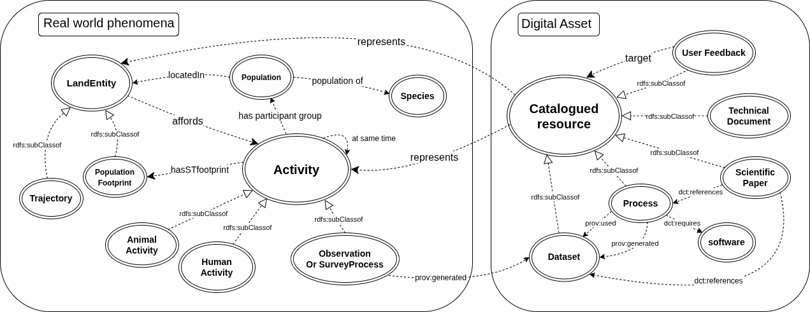
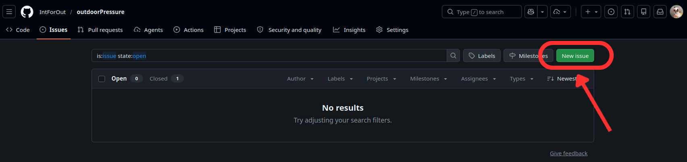

# Outdoor Pressure Knowledge Graph

Outdoor Pressure Knowledge Graph (ODO) encodes into a graph model different information needed to discover and reuse data to study the impact of recreational activities in the French Alps. It reuses classes and properties from the more generic [Geodata Knowledge Graph](https://github.com/umrlastig/geodata) and introduces new elements to represent information ranging from digital assets such as data sources and processes (see concepts on the right of the [figure 1](#odo-model)) to real-world phenomena they represent (see concepts on the left part of the [figure 1](#odo-model)).

See [Documentation](https://intforout.github.io/outdoorPressure/index.html) for more information.

<figure>
  
  <figcaption><em>figure 1: Overview of classes and properties that structure ODO</em></figcaption>
</figure>

ODO design is **task-driven**. Nodes and edges are gradually created to support specific tasks within [INTFOROUT project](https://www.umr-lastig.fr/intforout/). These tasks are then showcased through predefined queries in a dedicated software companion. See [Sham-Wah application](https://github.com/intForOut/sham-wah)

You are welcome to **contribute** to ODO through github issues in this project, by following the [guides](guides/readme.md) :

- create a UserFeedback to share your own expertise, experience, or observations about data, software, or papers you read.
- create a Dataset to describe data that is relevant to the scope. A dataset is "a coherent collection of information or resources (data files, explanatory files, APIs, links, etc.) and metadata (description, publication date, keywords, geographical/temporal coverage, etc.)."
- create a Blank issue for everything else of if you are not sure about the categories of instance you wish to insert.

<figure>
  
  <figcaption><em>figure 2: Opening the Github Issue tab</em></figcaption>
</figure>
​

This work is supported by the ANR research project IntForOut: Multisource spatial data INTegration FOR the Monitoring of Ecosystems under the pressure of OUTdoor recreation (ANR-23-CE55-0003).
