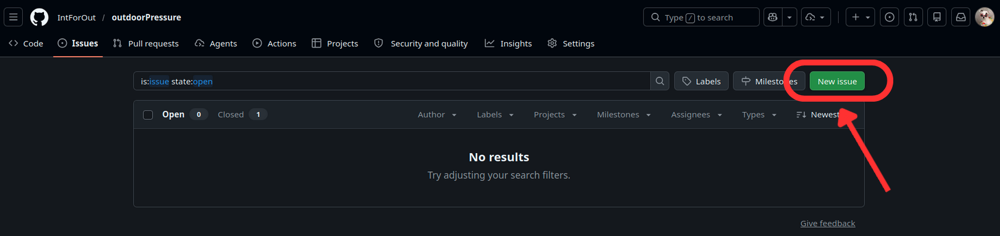
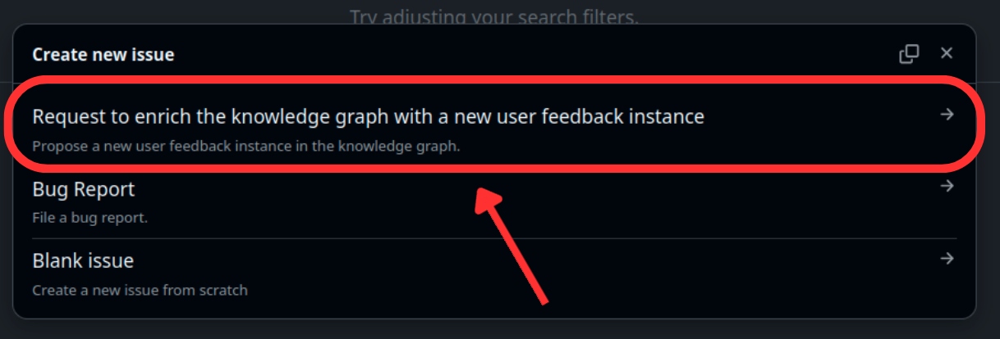

# Integrating Data Profiling Reports into the Knowledge Graph

These steps explain how to integrate an existing data‑profiling report into the Outdoor Pressure Knowledge Graph. The report you want to add includes statistics, diagrams, data‑quality findings, and analysis, all compiled into a PDF File.

To integrate a report, we represent it as a [Geospatial User Feedback](https://www.ogc.org/standards/guf/) node with the following properties:

- A comment describing which data were profiled and stating that the results are available in the report
- An author
- Targets, including:
  - the PDF file node
  - one or more data nodes in the Knowledge Graph that the report refers to

## Upload the PDF File in the Github Repository

First, upload the PDF report to the appropriate directory in the GitHub project:

1. Fork the GitHub repository to your own account (because you do not have write access to the main Knowledge Graph repository).

2. Clone your fork to your local machine:

```bash
git clone <your-fork-url>
```

Or directly from the github interface upload the file.

3. In the directory expertsfeedback/reports, add the PDF file using an appropriate name (Format: “Profilage + DataName”)
   - e.g. **ProfilageDeepFaune.pdf**

4. Commit and push your changes to your fork.

5. Create a pull request from your fork to the original repository.

## Define the Information Linked to the Nodes

Collect the following information and send it to us using the form template available through the GitHub “Issue” button.
We will use this information to update the Knowledge Graph.

To access the form, open the Issues tab as shown below:

<p align='left' style="margin-top: 20px;">

</p>

Then select the appropriate form template:

<p align='left' style="margin-top: 20px;">

</p>

You will need to define the metadata for two nodes:

    - A File node (representing the PDF)
    - A UserFeedback node (representing the description of the profiling work)

1. Information Required for the File Node. Please define the following:

- IRI for the File node
  - e.g. **https://intforout.github.io/outdoorPressure#ProfilageDataPhDKerouanton.pdf**

2. Information Required for the UserFeedback Node. Please define the following:

- IRI for the UserFeedback node (Format: “Profilage + DataName + Author”)
  - e.g. **https://intforout.github.io/outdoorPressure#ProfilageDonneesKerouantonANaciri**

- Comment describing the profiling work
  - e.g. **Analyse « profilage » des données de recherche produites par Colin Kerouanton, notamment de la distribution des valeurs (target 1). Le résultat de l’analyse est partagé dans un rapport (target 2).**

- Author:
  - Check whether the corresponding Person node already exists in the Knowledge Graph.
    If not, propose an IRI and we will add it.
  - e.g. **https://intforout.github.io/outdoorPressure#anaciri**

- Targets
  - Data target: **https://intforout.github.io/outdoorPressure#KerouantonSurveyFieldCampaignTracksGNSS20142015**
  - PDF target: **https://intforout.github.io/outdoorPressure#ProfilageDataPhDKerouanton.pdf**
  - There could be more data target if the comment deals with more data
